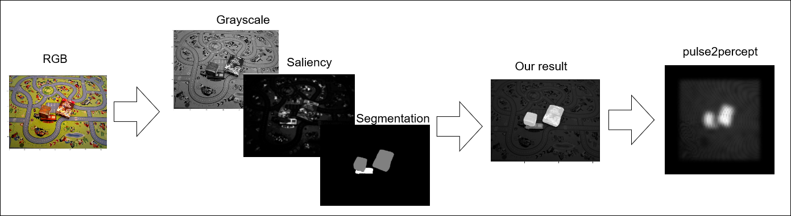

# Object instance segmentation for better distinguishability in in-door scenes

Retinal degenerative diseases lead many people to lose their vision which significantly reduces their abilities to successfully participate in everyday life and the number of tasks they are able to accomplish. Furthermore, due to the low resolution of currently available certified bionic implants, several tasks (like objects differentiation and separation) are very hard or impossible. 

In this paper, we provide a method of combining the modern deep-learning models with graph theory to facilitate objects' location, identification, and visual separation from each other. We show that our approach steadily facilitates the mentioned task when objects are stacked or located near each other. We also provide ideas of possible improvements and extensions to this work to provide bionic implant users a better experience and facilitate their everyday lives.

## Code usage
- Import the `src/highlighter/Highlighter.py` class and use corresponding methods
- See `src/highlighter/notebooks/` for examples of usage 

## Report compilation:
- Install `acmart` 1.80 package and `libertine` package
- Use `pdflatex` wit default recipe (`pdflatex -> bibtex -> pdflatex x2`)